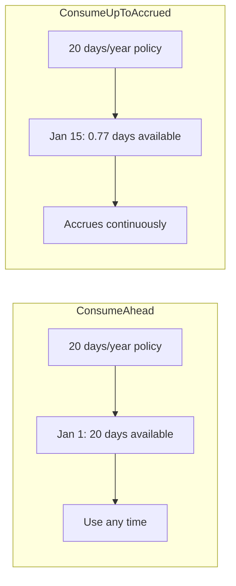
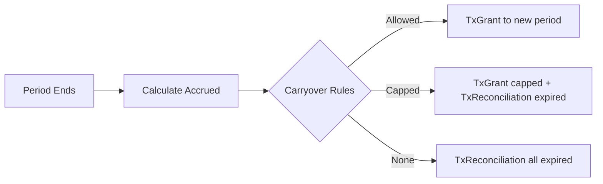
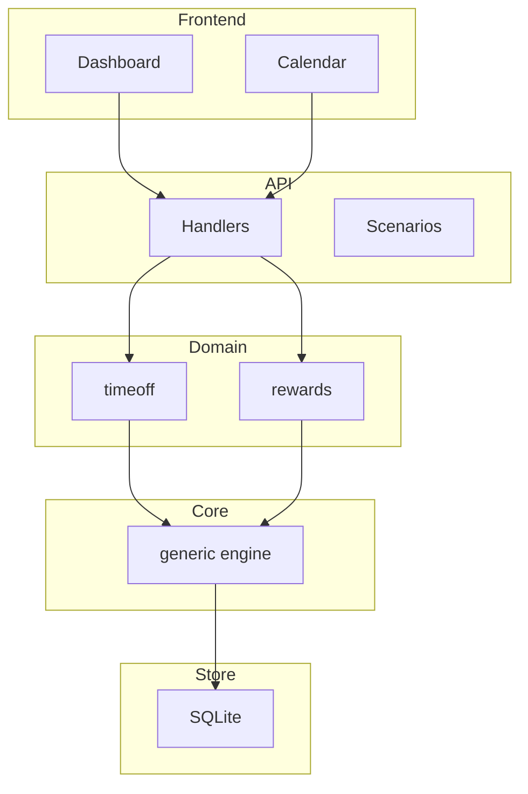

# TimeOff - Generic Timed Resource Management Engine

> A single engine for tracking any time-bounded resource—PTO, sick leave, wellness points, learning budgets—using an append-only ledger, period-based balance calculation, and policy-driven reconciliation.

[](https://go.dev/)
[](https://react.dev/)
[](./docs/TESTING.md)

---

## Screenshots

| Dashboard | Multi-Policy | Date Picker |
|-----------|--------------|-------------|
|  |  |  |

| Request Confirmation | Calendar | Rewards |
|---------------------|----------|---------|
|  |  |  |

---

## The Problem

Every company builds separate systems for PTO, rewards points, learning budgets—all with duplicated logic for balance tracking, accruals, and period management.

**The Solution:** One generic engine that handles the math; domains add constraints.

---

## Design Philosophy

### Core Insight

A PTO balance, a rewards point total, and a learning budget are all the same thing: **a number that changes over time according to rules**. The rules differ (accrual rates, expiration, carryover), but the mechanics are identical.

### Key Principles

**1. Append-Only Ledger**
Never delete, never update—only append. Every change is a new transaction. This gives you a complete audit trail and makes debugging trivial. Want to undo something? Add a reversal transaction.

**2. On-Demand Computation**
Accruals are **computed at query time**, not stored. No cron jobs generating accrual records. No "accrual transactions" cluttering the ledger. Ask "what's my balance on March 15?" and the engine computes accruals from policy start to March 15, then adds/subtracts actual transactions.

**3. Period-Based Balance**
Balance is always relative to a **period** (usually a calendar year). "20 days available" means 20 days for *this period*. When the period ends, reconciliation handles carryover/expiration and starts fresh.

**4. Policy Drives Everything**
A policy defines: how much is granted, how it accrues, what happens at period end, whether you can go negative. The engine just executes rules—it has zero domain knowledge.

### The Two Consumption Modes



- **ConsumeAhead**: Full entitlement available on day 1. Typical for salaried employees.
- **ConsumeUpToAccrued**: Only use what's been earned. Accrues continuously (pro-rated to the day). Rate is configurable: per year, per month, per hours worked, etc.

### How Balance is Calculated

```
Balance = Computed Accruals (based on policy + time elapsed)
        + Grants (bonuses, carryovers)
        - Consumptions (time off taken)
        - Pending (approved but not yet taken)
        + Reversals (cancellations)
```

No stored "accrual transactions"—just the formula applied at query time.

### Transaction Types

| Type | Description | Example |
|------|-------------|---------|
| `TxGrant` | One-time credit | Carryover from last year, signing bonus |
| `TxConsumption` | Resource used | Took Jan 15 off |
| `TxPending` | Approved, not yet used | Vacation next month |
| `TxReversal` | Undo a consumption | Cancelled a day |
| `TxReconciliation` | Period-end adjustment | Expired 3 unused days |
| `TxAdjustment` | Admin correction | Fixed a mistake |

### Reconciliation (End of Period)

When a period ends:
1. Calculate actual accrued balance (what was earned)
2. Apply carryover rules (cap at X days, or none)
3. Expire what can't carry over
4. Create `TxGrant` for carryover in new period
5. Create `TxReconciliation` for expired amount



---

## Key Features

| Feature | Description |
|---------|-------------|
| **Generic Engine** | Works for PTO, rewards, learning budgets, any timed resource |
| **Multi-Policy** | Multiple policies per employee with priority-based consumption |
| **Two Modes** | ConsumeAhead (use full year) vs ConsumeUpToAccrued (only earned) |
| **Reconciliation** | Automatic year-end rollovers, carryovers, and expirations |
| **Append-Only Ledger** | Immutable transaction log for complete audit trail |
| **Day Uniqueness** | Can't take the same day off twice (time-off domain) |
| **Per-Day Cancellation** | Cancel individual days from multi-day requests |

---

## Quick Start

```bash
# Clone
git clone git@github.com:AntoineToussaint/timeoff.git
cd timeoff

# Install
go mod download
cd web && npm install && cd ..

# Run
make dev

# Open http://localhost:5173
```

### Demo Scenarios

Load via the UI or API:

| Scenario | Description |
|----------|-------------|
| `new-employee` | Single PTO policy, ConsumeAhead mode |
| `multi-policy` | 3 PTO policies + sick leave with priorities |
| `year-end-rollover` | Carryover with cap, reconciliation |
| `hourly-worker` | ConsumeUpToAccrued mode |
| `rewards-benefits` | Wellness points, learning credits |

---

## Architecture



### Project Structure

```
timeoff/
├── generic/          # Core engine (zero domain knowledge)
│   ├── balance.go    # Balance calculation
│   ├── ledger.go     # Append-only transaction log
│   ├── policy.go     # Policy & reconciliation rules
│   └── accrual.go    # Accrual schedules
├── timeoff/          # Time-off domain (PTO, sick, parental)
├── rewards/          # Rewards domain (points, credits)
├── api/              # REST handlers & scenarios
├── store/sqlite/     # Persistence layer
└── web/              # React frontend
```

---

## Requirements Coverage

**100% of core requirements implemented + all bonus challenges.**

| Category | Requirement | Status |
|----------|-------------|--------|
| Core | Policies unlimited or accrual-based | ✅ |
| Core | Accrual per time (20 days/year) | ✅ |
| Core | Accrual per hours worked | ✅ |
| Core | Balance tracking | ✅ |
| Core | Employee time-off requests | ✅ |
| Core | Admin approval workflow | ✅ |
| Core | Multiple policies per company | ✅ |
| Consider | Mid-year hire prorating | ✅ |
| Consider | Negative balance allowed | ✅ |
| Bonus | Company holiday calendars | ✅ |
| Bonus | Carryover & expiration | ✅ |
| Bonus | Tenure-based policies | ✅ |

---

## Documentation

| Document | Description |
|----------|-------------|
| [DESIGN.md](docs/DESIGN.md) | Philosophy, core concepts, design decisions |
| [ENGINEERING.md](docs/ENGINEERING.md) | Architecture, data flow, diagrams |
| [GETTING_STARTED.md](docs/GETTING_STARTED.md) | Setup and first steps |
| [IMPLEMENTATION.md](docs/IMPLEMENTATION.md) | Technical details, database schema |
| [TESTING.md](docs/TESTING.md) | Test coverage (135+ tests) |

---

## Testing

```bash
make test          # Run all tests
make test-race     # With race detector
make test-cover    # With coverage
```

---

## License

MIT
