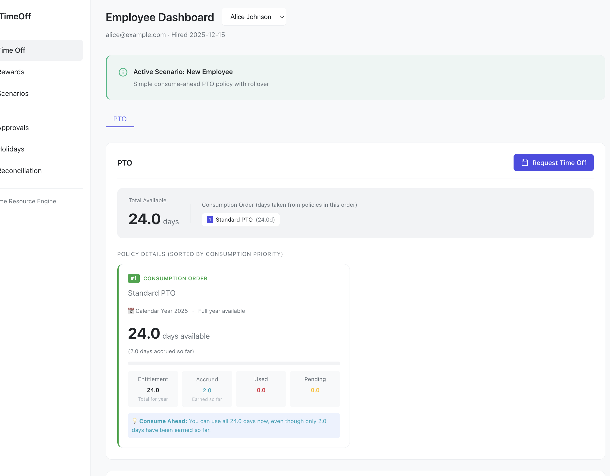
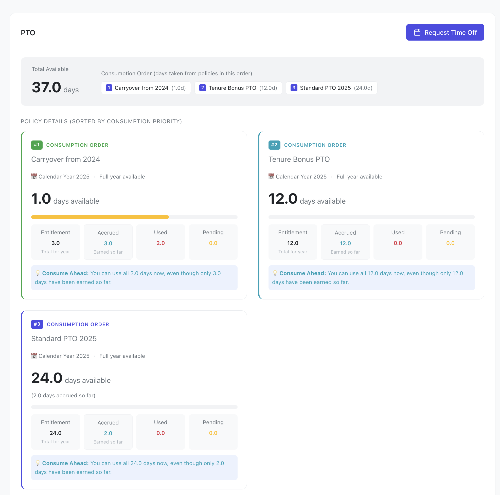
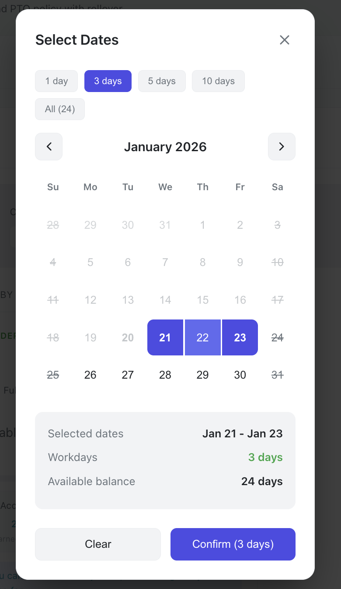
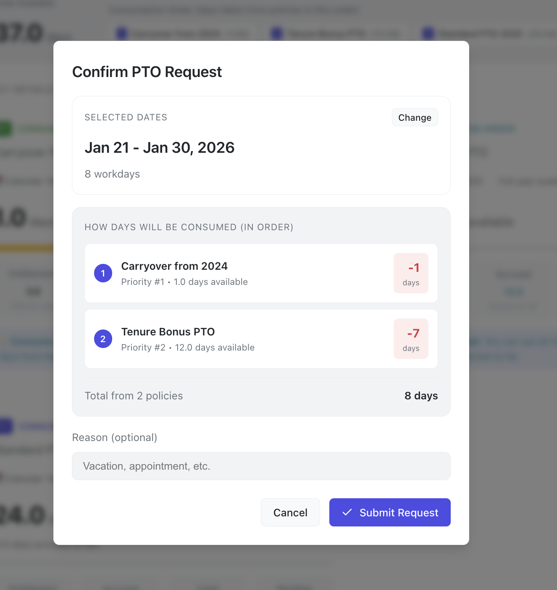
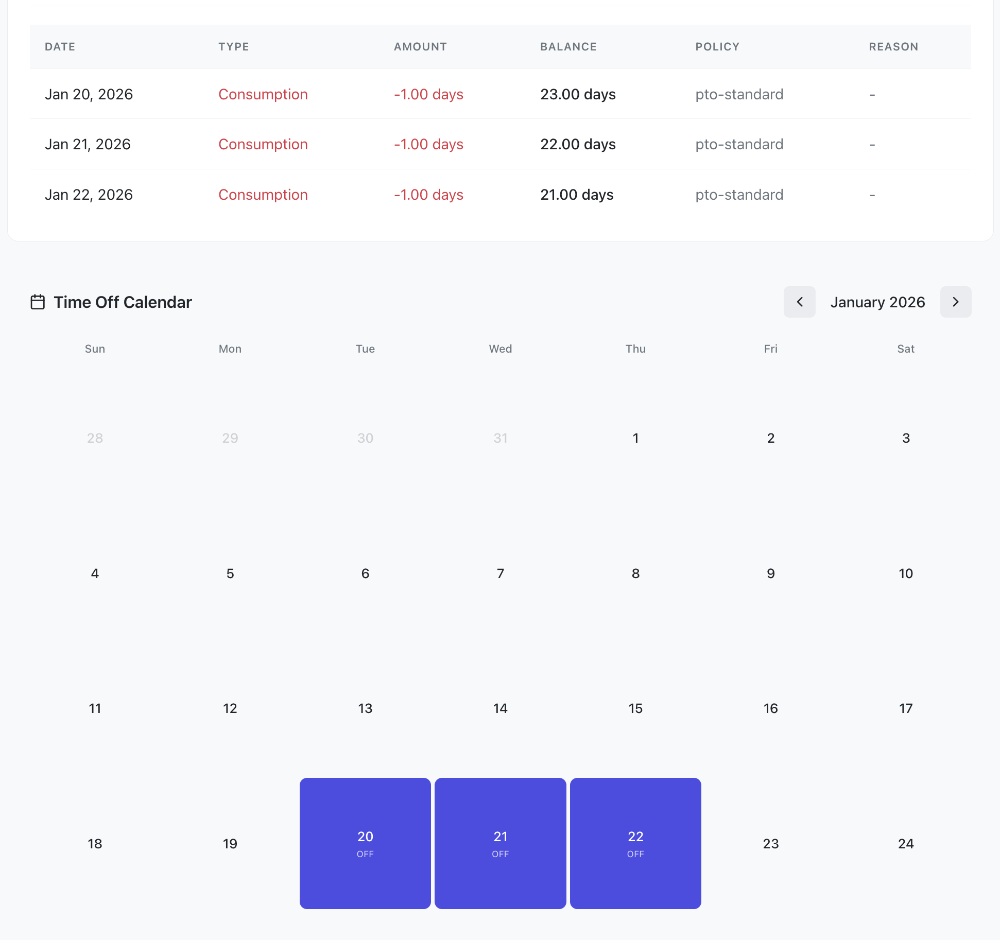
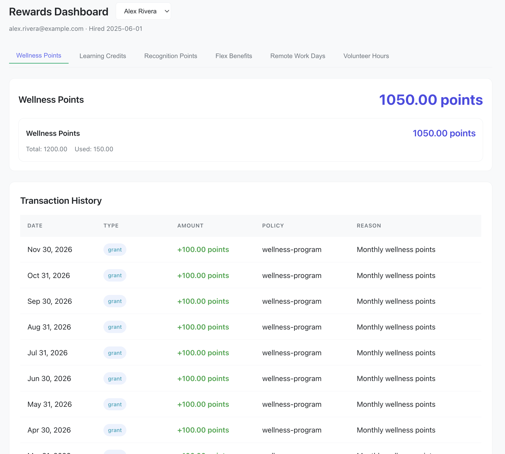
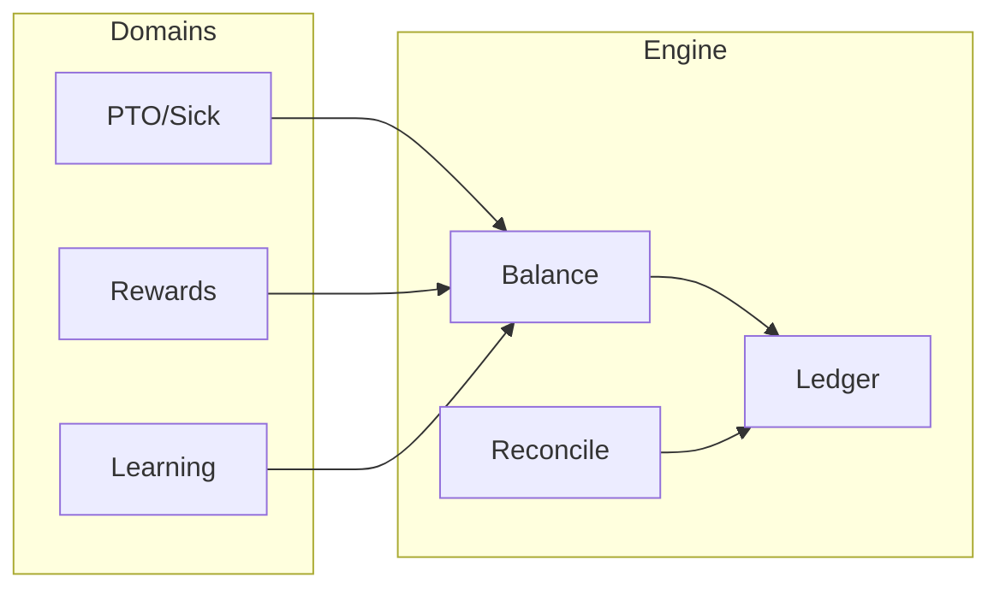
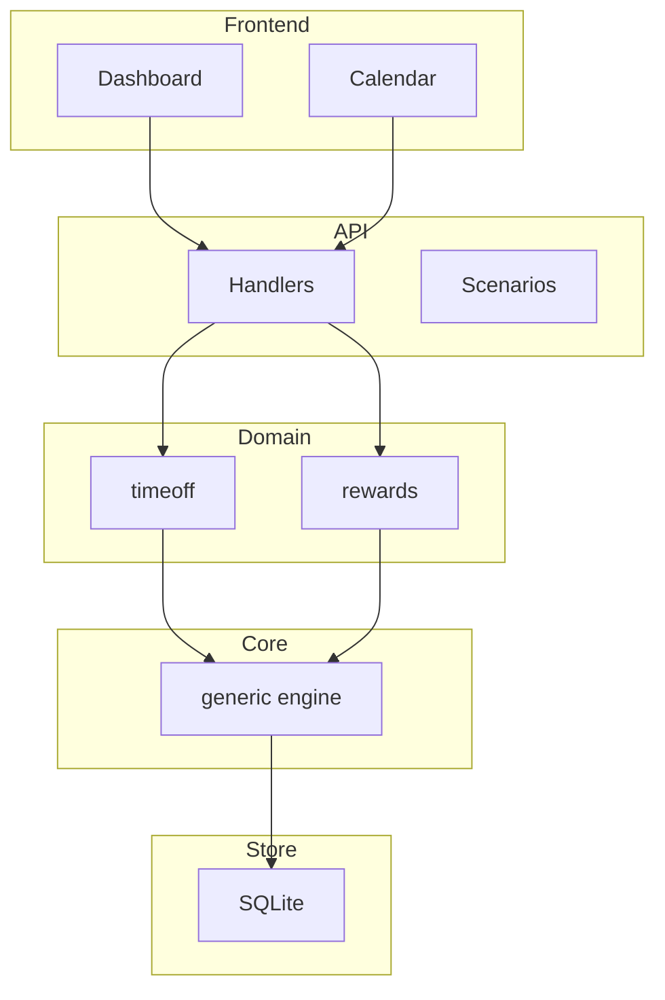

# TimeOff - Generic Timed Resource Management Engine

> A single engine for tracking any time-bounded resource—PTO, sick leave, wellness points, learning budgets—using an append-only ledger, period-based balance calculation, and policy-driven reconciliation.

[](https://go.dev/)
[](https://react.dev/)
[](./docs/TESTING.md)

---

## Screenshots

| Dashboard | Multi-Policy | Date Picker |
|-----------|--------------|-------------|
|  |  |  |

| Request Confirmation | Calendar | Rewards |
|---------------------|----------|---------|
|  |  |  |

---

## The Problem

Every company builds separate systems for PTO, rewards points, learning budgets—all with duplicated logic for balance tracking, accruals, and period management.

**The Solution:** One generic engine that handles the math; domains add constraints.



---

## Key Features

| Feature | Description |
|---------|-------------|
| **Generic Engine** | Works for PTO, rewards, learning budgets, any timed resource |
| **Multi-Policy** | Multiple policies per employee with priority-based consumption |
| **Two Modes** | ConsumeAhead (use full year) vs ConsumeUpToAccrued (only earned) |
| **Reconciliation** | Automatic year-end rollovers, carryovers, and expirations |
| **Append-Only Ledger** | Immutable transaction log for complete audit trail |
| **Day Uniqueness** | Can't take the same day off twice (time-off domain) |
| **Per-Day Cancellation** | Cancel individual days from multi-day requests |

---

## Quick Start

```bash
# Clone
git clone git@github.com:AntoineToussaint/timeoff.git
cd timeoff

# Install
go mod download
cd web && npm install && cd ..

# Run
make dev

# Open http://localhost:5173
```

### Demo Scenarios

Load via the UI or API:

| Scenario | Description |
|----------|-------------|
| `new-employee` | Single PTO policy, ConsumeAhead mode |
| `multi-policy` | 3 PTO policies + sick leave with priorities |
| `year-end-rollover` | Carryover with cap, reconciliation |
| `hourly-worker` | ConsumeUpToAccrued mode |
| `rewards-benefits` | Wellness points, learning credits |

---

## Architecture



### Project Structure

```
timeoff/
├── generic/          # Core engine (zero domain knowledge)
│   ├── balance.go    # Balance calculation
│   ├── ledger.go     # Append-only transaction log
│   ├── policy.go     # Policy & reconciliation rules
│   └── accrual.go    # Accrual schedules
├── timeoff/          # Time-off domain (PTO, sick, parental)
├── rewards/          # Rewards domain (points, credits)
├── api/              # REST handlers & scenarios
├── store/sqlite/     # Persistence layer
└── web/              # React frontend
```

---

## Requirements Coverage

**100% of core requirements implemented + all bonus challenges.**

| Category | Requirement | Status |
|----------|-------------|--------|
| Core | Policies unlimited or accrual-based | ✅ |
| Core | Accrual per time (20 days/year) | ✅ |
| Core | Accrual per hours worked | ✅ |
| Core | Balance tracking | ✅ |
| Core | Employee time-off requests | ✅ |
| Core | Admin approval workflow | ✅ |
| Core | Multiple policies per company | ✅ |
| Consider | Mid-year hire prorating | ✅ |
| Consider | Negative balance allowed | ✅ |
| Bonus | Company holiday calendars | ✅ |
| Bonus | Carryover & expiration | ✅ |
| Bonus | Tenure-based policies | ✅ |

---

## Documentation

| Document | Description |
|----------|-------------|
| [DESIGN.md](docs/DESIGN.md) | Philosophy, core concepts, design decisions |
| [ENGINEERING.md](docs/ENGINEERING.md) | Architecture, data flow, diagrams |
| [GETTING_STARTED.md](docs/GETTING_STARTED.md) | Setup and first steps |
| [IMPLEMENTATION.md](docs/IMPLEMENTATION.md) | Technical details, database schema |
| [TESTING.md](docs/TESTING.md) | Test coverage (135+ tests) |

---

## Testing

```bash
make test          # Run all tests
make test-race     # With race detector
make test-cover    # With coverage
```

---

## License

MIT
