# TimeOff - Generic Timed Resource Management Engine

> **A single, mathematically rigorous engine for tracking any time-bounded resource—PTO, sick leave, wellness points, learning budgets—using an append-only ledger, period-based balance calculation, and policy-driven reconciliation.**

[](https://go.dev/)
[](https://react.dev/)
[](./docs/TESTING.md)
[](LICENSE)

---

## Screenshots

### Employee Dashboard

*Single policy view with balance breakdown, consumption order, and request button*

### Multi-Policy Balance

*Multiple PTO policies with priority-based consumption order (Carryover → Bonus → Standard)*

### Date Range Picker

*Calendar-based date selection with workday calculation and quick-select options*

### Request Confirmation

*Shows exactly how days will be consumed from each policy in priority order*

### Time-Off Calendar

*Visual calendar showing scheduled time off with transaction history*

### Rewards Dashboard

*Generic resource support: wellness points, learning credits, recognition points*

---

## What Problem Does This Solve?

Every company builds separate systems for:
- **Time-off management** (PTO, sick leave, parental)
- **Rewards points** (wellness, recognition, peer bonuses)
- **Learning budgets** (training credits, certifications)
- **Expense credits** (meal allowances, transportation)

**Each system duplicates the same logic:**
- Balance tracking
- Accrual calculations
- Period management (year-end rollovers)
- Audit trails
- Multi-policy support

### The Solution: One Engine, Multiple Domains

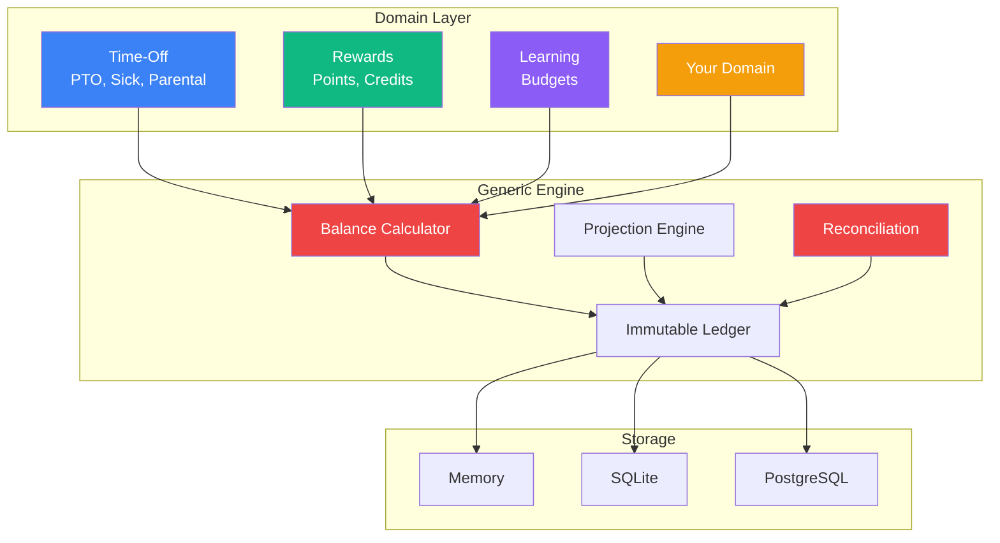

**Key Insight:** All timed resources share the same fundamental operations: accrue, consume, reconcile. The differences are in constraints and semantics, not math.

---

## ✨ Key Features

| Feature | Description |
|---------|-------------|
| 🎯 **Generic Engine** | Works for PTO, sick leave, rewards points, learning budgets, or any timed resource |
| 📅 **Period-Based Balance** | Tracks resources within fiscal/calendar year boundaries |
| 🔄 **Multi-Policy Support** | Employees can have multiple policies with priority-based consumption |
| 🔁 **Reconciliation Engine** | Handles year-end rollovers, carryovers, and expirations automatically |
| 📜 **Append-Only Ledger** | Immutable transaction log for complete audit compliance |
| ⚡ **Consumption Modes** | "Consume Ahead" (use future accruals) vs "Consume Up To Accrued" (only what's earned) |
| 🧪 **135+ Tests** | Comprehensive test coverage including all demo scenarios |

---

## 🏗️ Architecture Overview

### System Layers

```mermaid
graph TB
    subgraph Frontend["🌐 Frontend Layer"]
        DASH[Dashboard]
        SCEN[Scenarios]
        REQ[Requests]
    end
    
    subgraph API["🔌 API Layer"]
        HAND[Handlers]
        SCENAPI[Scenarios]
        DTO[DTOs]
    end
    
    subgraph Domain["📦 Domain Layer"]
        TO_DOM[timeoff/<br/>PTO, Sick, Parental]
        RW_DOM[rewards/<br/>Wellness, Learning]
    end
    
    subgraph Engine["⚙️ Generic Engine"]
        BAL_ENG[Balance<br/>Calculator]
        REC_ENG[Reconciliation<br/>Engine]
        LED_ENG[Ledger<br/>Immutable]
        PROJ_ENG[Projection<br/>Engine]
        POL_ENG[Policy<br/>Rules]
        ASS_ENG[Assignment<br/>Multi-Policy]
    end
    
    subgraph Storage["💾 Storage Layer"]
        SQLITE[SQLite]
        MEM_STORE[Memory]
    end
    
    DASH --> HAND
    SCEN --> SCENAPI
    REQ --> HAND
    
    HAND --> TO_DOM
    HAND --> RW_DOM
    
    TO_DOM --> BAL_ENG
    RW_DOM --> BAL_ENG
    
    BAL_ENG --> LED_ENG
    REC_ENG --> LED_ENG
    PROJ_ENG --> LED_ENG
    
    LED_ENG --> SQLITE
    LED_ENG --> MEM_STORE
    
    POL_ENG --> BAL_ENG
    ASS_ENG --> BAL_ENG
    
    style Frontend fill:#3b82f6,color:#fff
    style API fill:#10b981,color:#fff
    style Domain fill:#8b5cf6,color:#fff
    style Engine fill:#ef4444,color:#fff
    style Storage fill:#f59e0b,color:#fff
```

### Data Flow: Request to Balance

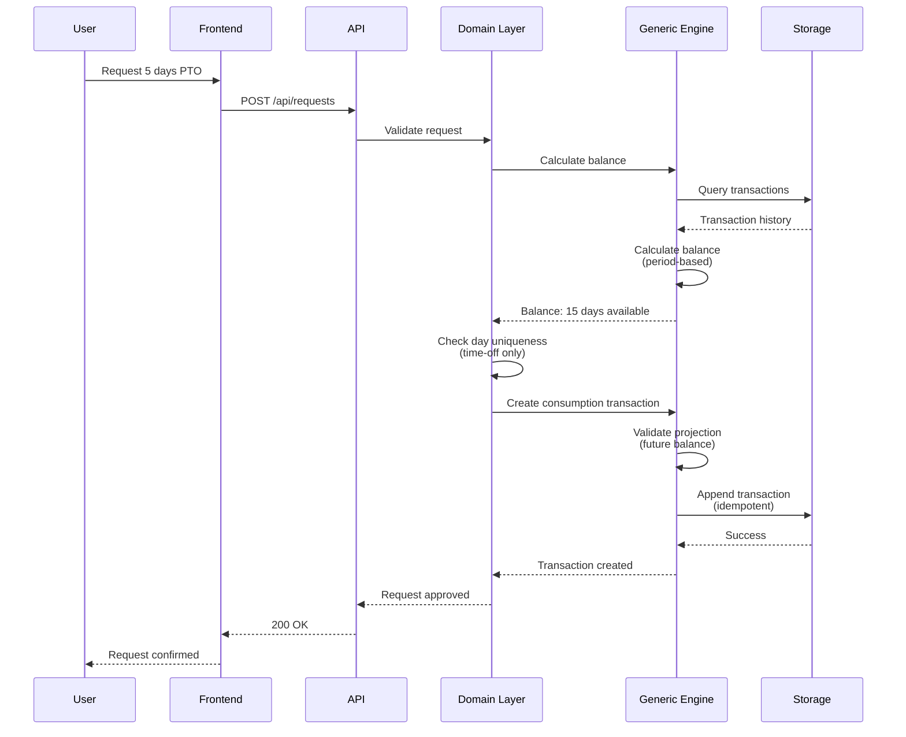

### Package Dependency Graph

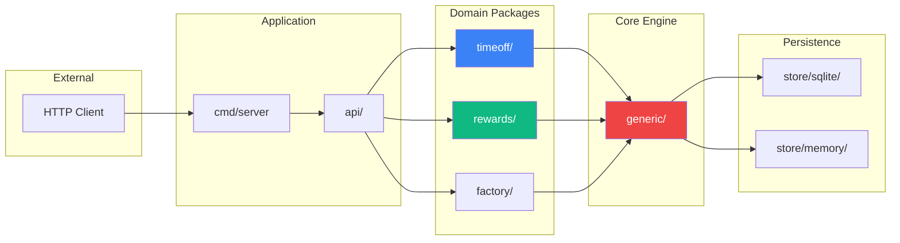

---

## 🧩 Core Concepts

### 1. The Ledger: Source of Truth

The ledger is an **append-only, immutable log** of all changes. Think of it like a bank statement—you never edit past entries, you only add new ones.

```mermaid
graph LR
    subgraph Ledger["📜 Transaction Ledger"]
        TX1[2025-01-01<br/>Accrual +20.00<br/>Annual grant]
        TX2[2025-02-15<br/>Consumption -5.00<br/>Vacation]
        TX3[2025-03-01<br/>Accrual +1.67<br/>Monthly]
        TX4[2025-12-31<br/>Reconciliation +5.00<br/>Carryover]
        TX5[2025-12-31<br/>Reconciliation -10.00<br/>Expired]
    end
    
    TX1 --> TX2
    TX2 --> TX3
    TX3 --> TX4
    TX4 --> TX5
    
    style TX1 fill:#10b981,color:#fff
    style TX2 fill:#ef4444,color:#fff
    style TX3 fill:#10b981,color:#fff
    style TX4 fill:#3b82f6,color:#fff
    style TX5 fill:#f59e0b,color:#fff
```

**Why append-only?**
- ✅ Complete audit trail
- ✅ No data loss from bugs or mistakes
- ✅ Time-travel queries ("what was the balance on March 15th?")
- ✅ Idempotent operations (replaying transactions produces the same result)

### 2. Periods: The Balance Boundary

A **Period** defines the time window for balance calculations. Balance only makes sense within a period.


### 3. Balance Calculation: Accrued vs Entitlement

The system tracks two balance concepts:

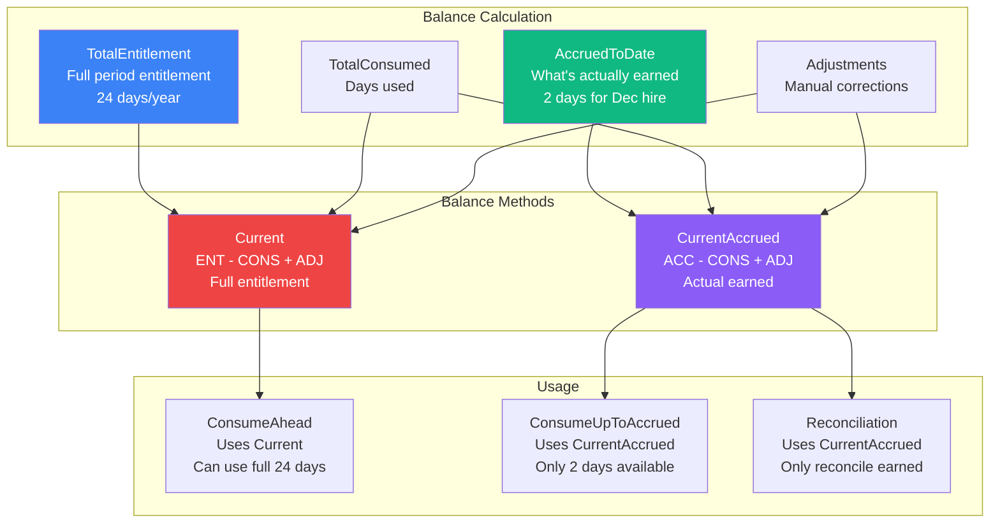

**Example**: Employee hired Dec 15 with 24 days/year policy:
- **AccruedToDate** (Dec 31): ~2 days (prorated for December)
- **TotalEntitlement**: 24 days (full year)
- **Available** (ConsumeAhead): 24 days (can use full year)
- **Available** (ConsumeUpToAccrued): 2 days (only what's earned)
- **Reconciliation**: Uses 2 days (only earned balance can carry over)

### 4. Consumption Modes

Two fundamentally different approaches:

```mermaid
graph LR
    subgraph CA["ConsumeAhead Mode<br/>Salaried PTO"]
        CA_POL[Policy: 20 days/year]
        CA_AVAIL[Available Jan 1:<br/>20 days<br/>Full entitlement]
        CA_USE[Can use all 20 days<br/>immediately]
        
        CA_POL --> CA_AVAIL
        CA_AVAIL --> CA_USE
    end
    
    subgraph CUTA["ConsumeUpToAccrued Mode<br/>Hourly Worker"]
        CUTA_POL[Policy: 20 days/year]
        CUTA_AVAIL[Available Jan 1:<br/>1.67 days<br/>20 ÷ 12 months]
        CUTA_USE[Can only use<br/>what's earned]
        
        CUTA_POL --> CUTA_AVAIL
        CUTA_AVAIL --> CUTA_USE
    end
    
    style CA fill:#10b981,color:#fff
    style CUTA fill:#3b82f6,color:#fff
```

### 5. Multi-Policy Distribution

Employees can have multiple policies for the same resource type. Consumption is distributed by priority:

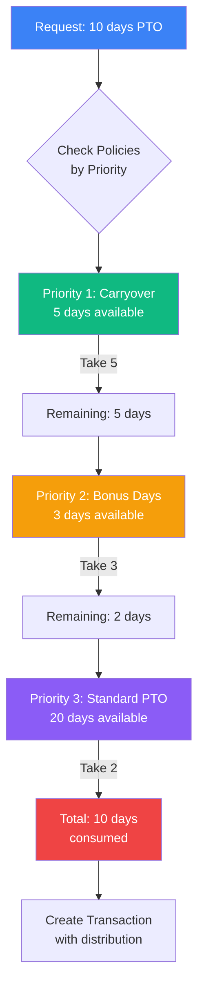

### 6. Reconciliation (Rollover & Expiration)

At period boundaries, the system processes reconciliation rules using **accrued balance** (what was actually earned), not full entitlement.


**Example Flow:**

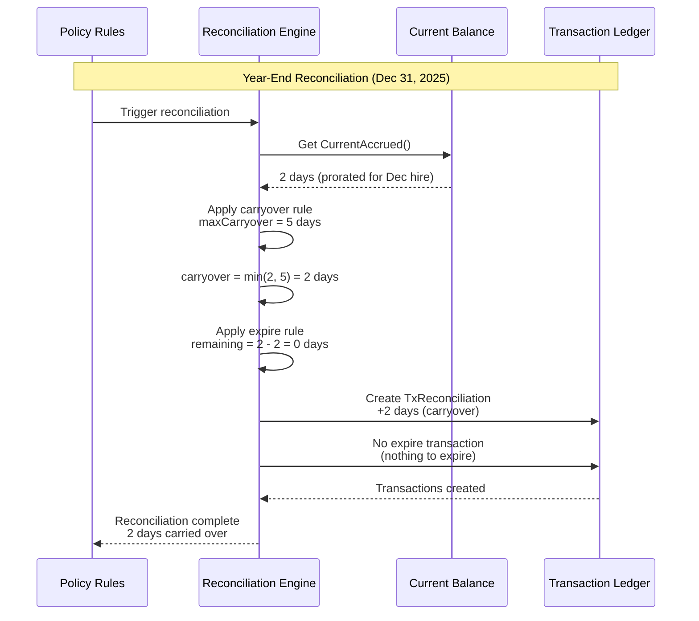

**Why CurrentAccrued()?**
- ✅ New hires only reconcile what they earned (e.g., 2 days for December hire, not 24)
- ✅ Mid-year policy changes reconcile correctly
- ✅ Only earned balance can be carried over or expired

### 7. Transaction Lifecycle


### 8. Policy Structure

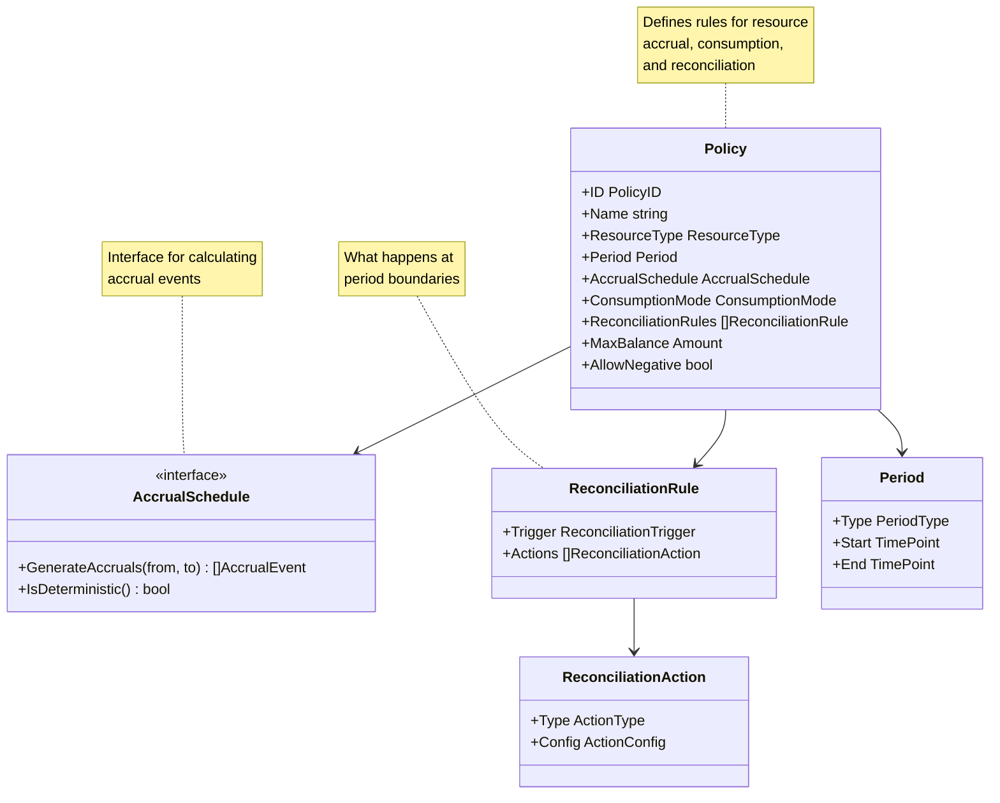

---

## 🚀 Quick Start

### Prerequisites

- Go 1.21+
- Node.js 18+ (for frontend)
- SQLite (included, no setup needed)

### Installation

```bash
# Clone the repository
git clone <repository-url>
cd warp

# Install Go dependencies
go mod download

# Install frontend dependencies
cd web && npm install && cd ..
```

### Running

```bash
# Run all tests
make test

# Start development servers (backend + frontend with hot-reload)
make dev

# Open http://localhost:5173 in your browser
```

### Demo Scenarios

The system includes 6 demo scenarios that showcase all features:

```mermaid
graph LR
    subgraph Scenarios["📊 Demo Scenarios"]
        S1[new-employee<br/>Single policy<br/>ConsumeAhead]
        S2[multi-policy<br/>Priority distribution<br/>3 PTO + sick]
        S3[year-end-rollover<br/>Carryover with cap<br/>Reconciliation]
        S4[policy-change<br/>Mid-year upgrade<br/>Reconciliation]
        S5[hourly-worker<br/>ConsumeUpToAccrued<br/>Only earned]
        S6[rewards-benefits<br/>Points system<br/>Multiple types]
    end
    
    S1 --> FEAT1[Basic accrual]
    S2 --> FEAT2[Multi-policy]
    S3 --> FEAT3[Rollover]
    S4 --> FEAT4[Policy change]
    S5 --> FEAT5[Accrued mode]
    S6 --> FEAT6[Rewards]
    
    style S1 fill:#10b981,color:#fff
    style S2 fill:#3b82f6,color:#fff
    style S3 fill:#8b5cf6,color:#fff
    style S4 fill:#ec4899,color:#fff
    style S5 fill:#f59e0b,color:#fff
    style S6 fill:#ef4444,color:#fff
```

Load scenarios via the UI or API:

```bash
# Via API
curl -X POST http://localhost:8080/api/scenarios/load \
  -H "Content-Type: application/json" \
  -d '{"scenario": "new-employee"}'
```

---

## 📊 Example: How It Works

### Scenario: Employee with Multiple Policies

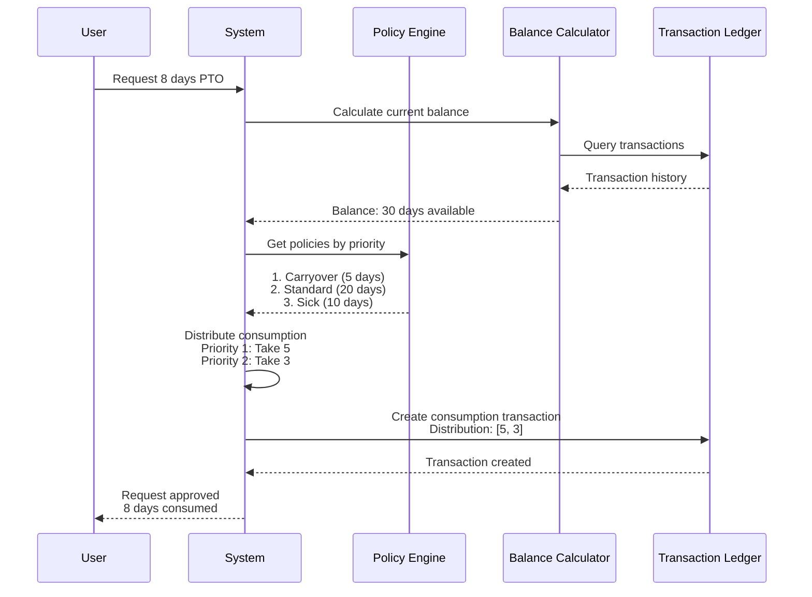

---

## 🧪 Testing

```bash
# Run all tests
make test

# Run with race detector
make test-race

# Run with coverage
make test-cover

# Run specific package tests
go test ./generic/... -v
go test ./timeoff/... -v
go test ./rewards/... -v
go test ./api/... -v
```

**135+ tests** covering:

```mermaid
graph TB
    subgraph Tests["🧪 Test Coverage"]
        GEN[Generic Engine<br/>24 spec tests<br/>35 engine tests]
        TO[Time-Off<br/>Multi-policy<br/>Rollover<br/>Day uniqueness]
        RW[Rewards<br/>Wellness points<br/>Learning credits<br/>Recognition]
        API[API Scenarios<br/>5 scenario tests<br/>Integration tests]
    end
    
    GEN --> COVERAGE[135+ Tests<br/>Comprehensive Coverage]
    TO --> COVERAGE
    RW --> COVERAGE
    API --> COVERAGE
    
    style GEN fill:#10b981,color:#fff
    style TO fill:#3b82f6,color:#fff
    style RW fill:#8b5cf6,color:#fff
    style API fill:#f59e0b,color:#fff
    style COVERAGE fill:#ef4444,color:#fff
```

---

## 📚 Documentation

```mermaid
graph LR
    subgraph Docs["📚 Documentation"]
        DESIGN[DESIGN.md<br/>Philosophy & Concepts]
        ENG[ENGINEERING.md<br/>Architecture & Flow]
        START[GETTING_STARTED.md<br/>Setup & Running]
        IMPL[IMPLEMENTATION.md<br/>Technical Details]
        TEST[TESTING.md<br/>Test Coverage]
        REVIEW[CODE_REVIEW_GUIDE.md<br/>How to Review]
    end
    
    START --> DESIGN
    DESIGN --> ENG
    ENG --> IMPL
    IMPL --> TEST
    TEST --> REVIEW
    
    style DESIGN fill:#3b82f6,color:#fff
    style ENG fill:#10b981,color:#fff
    style START fill:#8b5cf6,color:#fff
```

| Document | Description |
|----------|-------------|
| [**DESIGN.md**](docs/DESIGN.md) | Philosophy, core concepts, and design decisions |
| [**ENGINEERING.md**](docs/ENGINEERING.md) | Architecture, data flow, and implementation details |
| [**GETTING_STARTED.md**](docs/GETTING_STARTED.md) | Setup, running, and first steps |
| [**IMPLEMENTATION.md**](docs/IMPLEMENTATION.md) | Technical details, workflows, and database schema |
| [**TESTING.md**](docs/TESTING.md) | Test philosophy, coverage, and scenario mapping |
| [**CODE_REVIEW_GUIDE.md**](docs/CODE_REVIEW_GUIDE.md) | How to review the codebase |
| [**PERFORMANCE_QA.md**](docs/PERFORMANCE_QA.md) | Performance analysis and optimization |
| [**DEVOPS_SECURITY.md**](docs/DEVOPS_SECURITY.md) | Deployment and security considerations |

---

## 🏛️ Project Structure

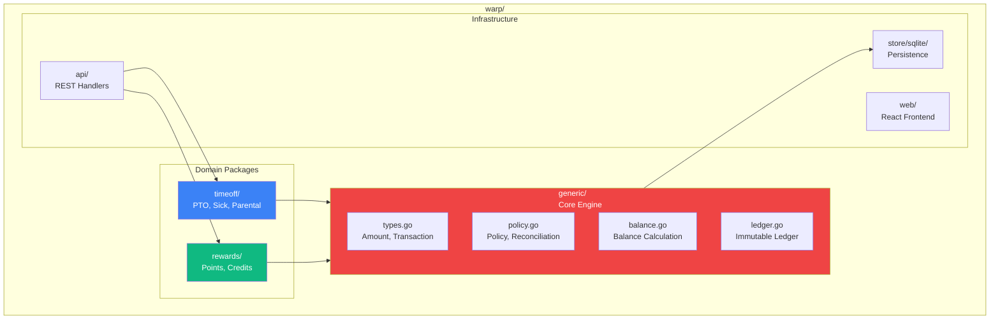

---

## 🎯 Key Design Decisions

### 1. Generic Engine, Not Domain-Specific

**Why?** Every company ends up building separate systems for PTO, rewards, learning budgets—all with duplicated logic. One engine handles the math; domains add constraints.

```mermaid
graph LR
    subgraph Old["❌ Old Approach"]
        O1[PTO System]
        O2[Rewards System]
        O3[Learning System]
        O4[Expense System]
        
        O1 -.->|Duplicated Logic| O2
        O2 -.->|Duplicated Logic| O3
        O3 -.->|Duplicated Logic| O4
    end
    
    subgraph New["✅ New Approach"]
        ENGINE[Generic Engine]
        D1[timeoff/]
        D2[rewards/]
        D3[learning/]
        D4[expense/]
        
        ENGINE --> D1
        ENGINE --> D2
        ENGINE --> D3
        ENGINE --> D4
    end
    
    style Old fill:#ef4444,color:#fff
    style New fill:#10b981,color:#fff
```

### 2. ResourceType as Interface, Not String

**Why?** Type safety at compile time. Generic engine has zero knowledge of domain-specific resources. Domains own their type definitions.

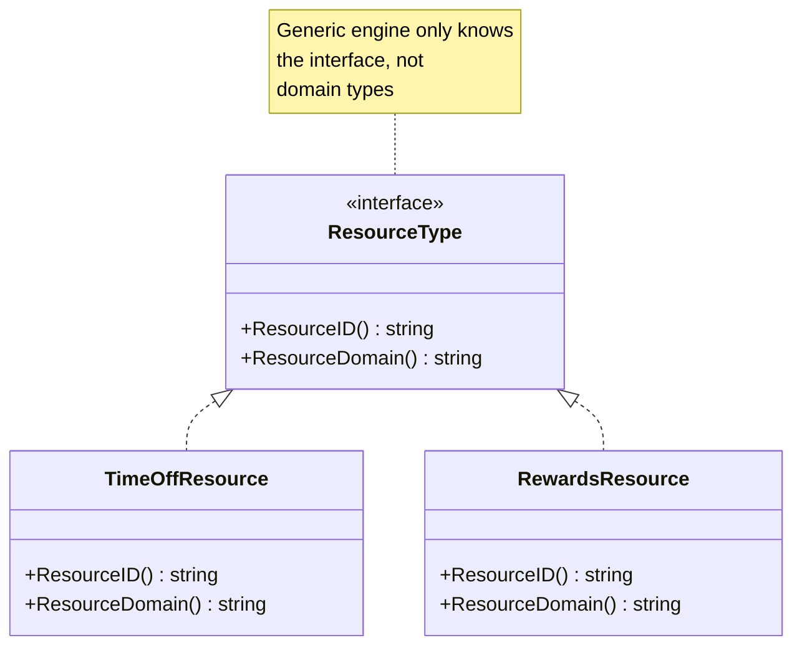

### 3. Append-Only Ledger

**Why?** Complete audit trail, no data loss, time-travel queries, idempotent operations.

```mermaid
graph LR
    subgraph Ledger["Append-Only Ledger"]
        TX1[Transaction 1]
        TX2[Transaction 2]
        TX3[Transaction 3]
        TX4[Transaction 4]
    end
    
    TX1 --> TX2
    TX2 --> TX3
    TX3 --> TX4
    
    TX1 -.->|Never Modified| TX1
    TX2 -.->|Never Deleted| TX2
    
    style TX1 fill:#10b981,color:#fff
    style TX2 fill:#10b981,color:#fff
    style TX3 fill:#10b981,color:#fff
    style TX4 fill:#10b981,color:#fff
```

### 4. Period-Based Balance

**Why?** Balance only makes sense within a period. "20 days of PTO" means nothing without knowing which year.

### 5. Reconciliation Uses Accrued Balance

**Why?** New hires should only reconcile what they earned (e.g., 2 days for December hire, not 24). Ensures correctness for mid-year changes.

---

## Requirements Status

This implementation covers **100% of core requirements** from the original specification.

### Core Requirements

| Requirement | Status | Implementation |
|-------------|--------|----------------|
| Policies unlimited or accrual-based | ✅ | `Policy.IsUnlimited`, `AccrualSchedule` interface |
| Accrual per time (20 days/year) | ✅ | `YearlyAccrual` with configurable frequency |
| Accrual per hours worked | ✅ | `HoursWorkedAccrual` + `PayrollEvent` |
| Balance tracking (increase/decrease) | ✅ | Append-only ledger with transaction types |
| Employee time-off requests | ✅ | Date selection UI, calendar view, cancellation |
| Admin approval workflow | ✅ | Full UI with approve/reject (see `/admin/approvals`) |
| Multiple policies per company | ✅ | Policy + Assignment model |
| Flexible employee grouping | ✅ | Assignment-based, not group-based |

### "Consider" Questions

| Question | Status | Implementation |
|----------|--------|----------------|
| Policy accrual update | ✅ | `Policy.Version` + `EffectiveAt` |
| Negative balance allowed? | ✅ | `Constraints.AllowNegative` |
| Mid-year hire prorating | ✅ | `ProrateMethod` + accrual from hire date |

### Bonus Challenges

| Challenge | Status | Implementation |
|-----------|--------|----------------|
| Custom work hours | ✅ | `Amount` with `Unit` (days, hours, minutes) |
| Company holiday calendars | ✅ | Holiday Admin UI (see `/admin/holidays`) |
| Carryover & expiration | ✅ | `ReconciliationEngine` with configurable rules |
| Tenure-based policies | ✅ | `TenureAccrual` with `TenureTier` progression |

### Beyond Requirements

| Feature | Description |
|---------|-------------|
| Generic Resource Engine | Works for PTO, rewards, learning budgets, any timed resource |
| Two Consumption Modes | `ConsumeAhead` vs `ConsumeUpToAccrued` |
| Multi-Policy Distribution | Priority-based consumption across policies |
| Day Uniqueness | `TimeOffLedger` prevents duplicate days off |
| Per-Day Cancellation | Cancel individual days from multi-day requests |
| Automated Reconciliation | Scheduled year-end processing (see `/admin/reconciliation`) |
| Calendar View | Visual time-off calendar with click-to-cancel |

---

## 🔮 Future Enhancements

```mermaid
graph LR
    subgraph Future["🔮 Roadmap"]
        E1[Authentication<br/>& Authorization]
        E2[Cross-Period<br/>Requests]
        E3[Audit<br/>Query API]
        E4[GraphQL<br/>API]
        E5[Webhook<br/>Support]
        E6[Balance<br/>Snapshots]
    end
    
    style E1 fill:#10b981,color:#fff
    style E2 fill:#ef4444,color:#fff
    style E3 fill:#3b82f6,color:#fff
    style E4 fill:#ec4899,color:#fff
    style E5 fill:#f59e0b,color:#fff
    style E6 fill:#8b5cf6,color:#fff
```

- [ ] Authentication and authorization
- [ ] Cross-period requests (spanning year boundaries)
- [ ] Audit query API
- [ ] GraphQL API
- [ ] Webhook support
- [ ] Balance snapshots for performance

---

## 📄 License

MIT

---

## 🙏 Acknowledgments

Built with a focus on:
- **Mathematical rigor**: Every calculation is tested
- **Clean architecture**: Generic engine has zero domain knowledge
- **Extensibility**: Easy to add new domains
- **Auditability**: Append-only ledger ensures complete history

---

**Ready to explore?** Start with [GETTING_STARTED.md](docs/GETTING_STARTED.md) or load a demo scenario in the UI!
