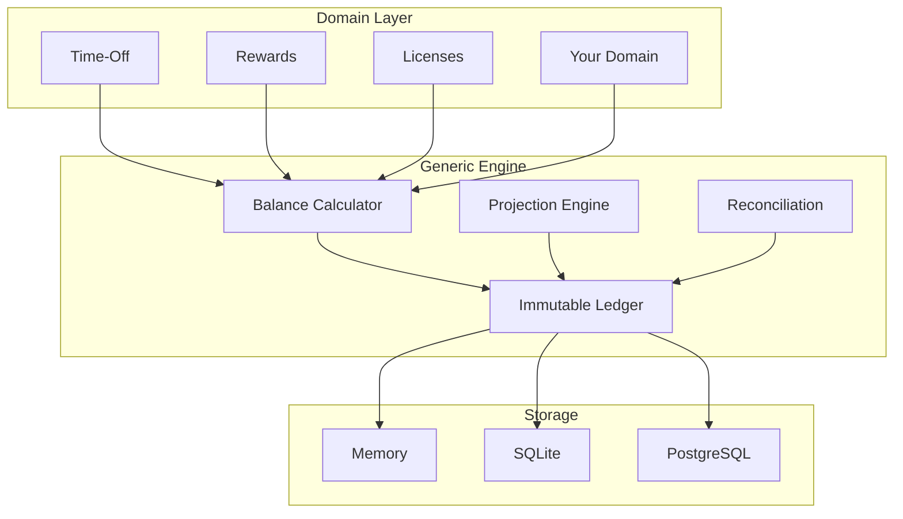
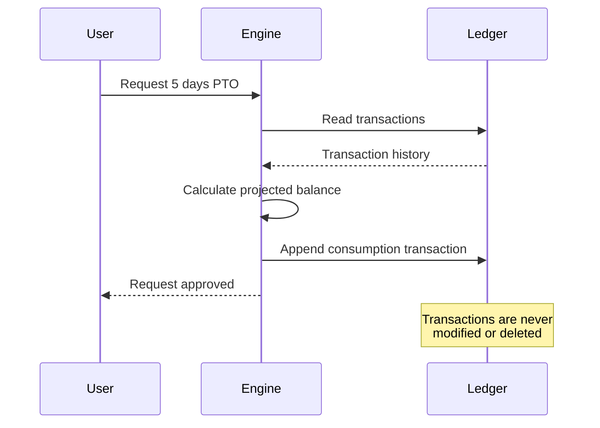
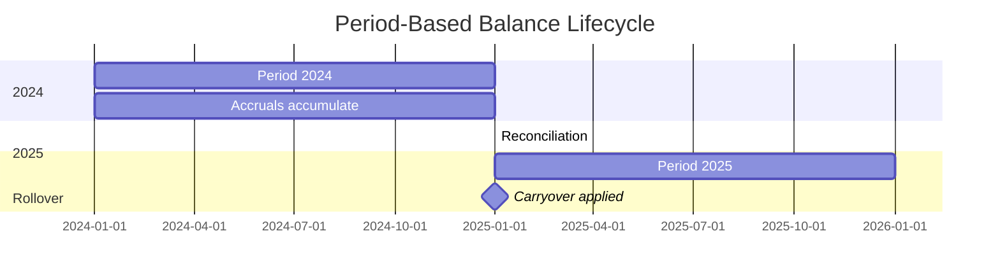
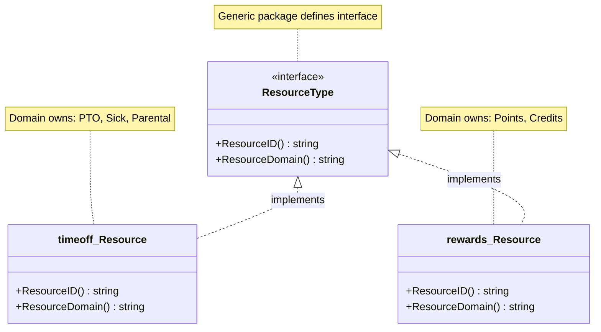
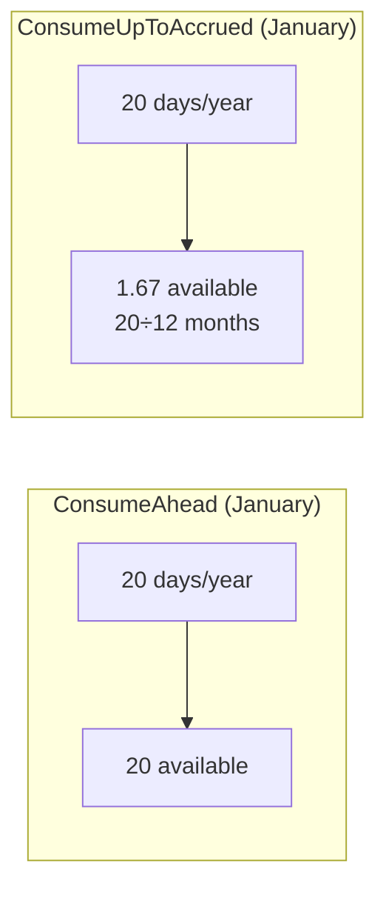
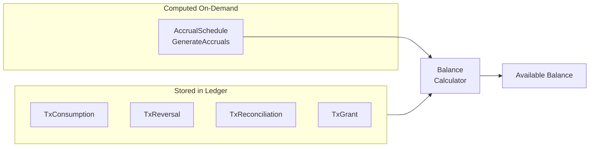
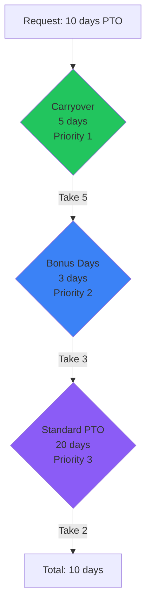
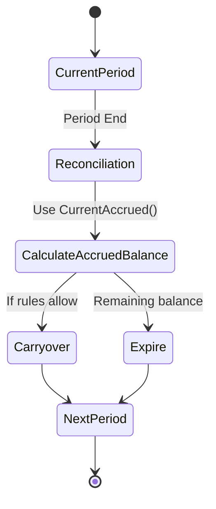
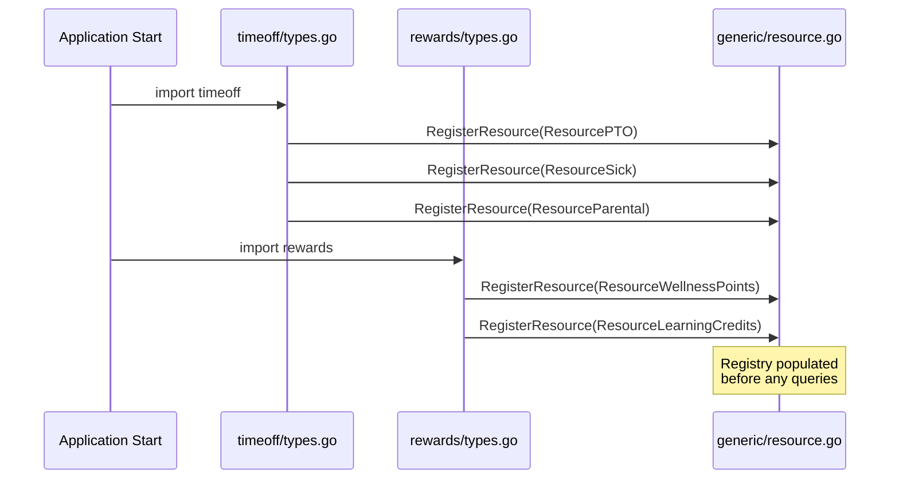
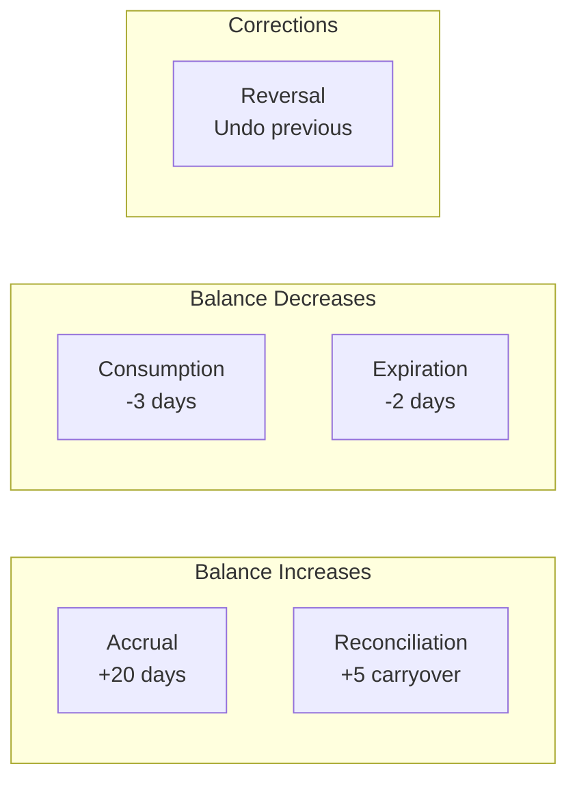

# Generic Timed Resource Management System

> **Summary:** This system provides a single, generic engine for tracking any time-bounded resource—PTO, sick leave, wellness points, learning budgets—using an append-only ledger, period-based balance calculation, and policy-driven reconciliation. The core `generic/` package handles all the math with zero domain knowledge, while domain packages (`timeoff/`, `rewards/`) implement the `ResourceType` interface and register their types at startup. Key concepts include Policies (accrual rules, carryover limits), Periods (calendar/fiscal year boundaries), Transactions (immutable ledger entries), and Reconciliation (year-end carryover/expiration). The architecture ensures clean separation of concerns, type safety via interfaces, and 108 unit tests validating all invariants.

---

## Design Philosophy

### The Core Insight

Time-off management, wellness points, learning budgets, and recognition systems all share the same fundamental problem: **tracking quantities that accumulate and deplete over bounded time periods**.

Rather than building separate systems for each use case, we designed a single, mathematically rigorous engine that handles the core mechanics, with domain-specific layers providing the human-friendly abstractions.



---

## Core Concepts

### 1. The Ledger: Source of Truth

The ledger is an **append-only, immutable log** of all changes to any resource balance. Think of it like a bank statement—you never edit past entries, you only add new ones.

**Why append-only?**
- Complete audit trail
- No data loss from bugs or mistakes
- Time-travel queries ("what was the balance on March 15th?")
- Idempotent operations (replaying transactions produces the same result)



### 2. Periods: The Balance Boundary

A **Period** defines the time window for balance calculations. Most organizations use calendar years, but the system supports any boundary:

| Period Type | Use Case |
|-------------|----------|
| Calendar Year | Standard PTO, annual budgets |
| Fiscal Year | Companies with non-calendar fiscal years |
| Anniversary | Balance resets on hire date anniversary |
| Rolling | Rolling 12-month window |

**The key insight**: Balance only makes sense within a period. "20 days of PTO" means nothing without knowing *which year*.



### 3. ResourceType: Domain-Owned Interface

**Key Design Decision**: ResourceType is an **interface**, not a string.



**Why an interface?**
- Generic engine has ZERO knowledge of domain-specific resources
- Domain packages own their type definitions
- Type safety at compile time
- Clean serialization via `ResourceID()`

### 4. Consumption Modes

Two fundamentally different approaches to "available balance":

| Mode | Description | Use Case |
|------|-------------|----------|
| **ConsumeAhead** | Full year entitlement available immediately | Salaried PTO, annual budgets |
| **ConsumeUpToAccrued** | Only earned balance available | Hourly workers, points programs |



### 4a. Accruals: Computed vs Stored

**Key Design Decision**: Deterministic accruals are **computed on-the-fly**, not stored as transactions.

| Category | Storage | Example |
|----------|---------|---------|
| **Deterministic Accruals** | Computed from `AccrualSchedule` | "24 days/year" → 2 days/month |
| **Non-Deterministic Grants** | Stored as `TxGrant` | Bonus days, kudos from peers, hours-worked accruals |
| **Consumption** | Stored as `TxConsumption` | Taking a day off |
| **Cancellation** | Stored as `TxReversal` | Cancelling a day off |
| **Period-End** | Stored as `TxReconciliation` | Carryover, expiration |

**Why computed accruals?**
- No redundant data (accrual schedule + computed transactions would be duplicates)
- Retroactive policy changes automatically recalculate balances
- Simpler: only actual events (consumption, grants) are stored
- Balance calculation combines: computed accruals + stored transactions



**When to use `TxGrant`:**
- One-time bonus days (not from a schedule)
- Peer recognition points (kudos)
- Hours-worked accruals (non-deterministic—depends on actual hours logged)
- Carryover balance transferred from old policy to new policy

### 5. Multi-Policy Distribution

Employees can have multiple policies for the same resource type. The system distributes consumption by priority:



### 6. Reconciliation (Rollover & Expiration)

At period boundaries, the system processes reconciliation rules:

| Action | Description |
|--------|-------------|
| **Carryover** | Move balance to next period (with optional cap) |
| **Expire** | Remove remaining balance |
| **Cap** | Limit maximum balance |

**Important**: Reconciliation uses **accrued balance** (`CurrentAccrued()`), not full entitlement (`Current()`). This ensures that:
- New hires only reconcile what they actually earned
- Mid-year policy changes reconcile correctly
- Only earned balance can be carried over or expired



**Example**: Employee hired Dec 15 with 24 days/year policy:
- **Accrued balance** at year-end: ~2 days (prorated for December)
- **Full entitlement**: 24 days (if using `Current()`)
- **Reconciliation**: Uses accrued balance (2 days), so only 2 days can carry over, not 24

---

## Domain Encapsulation

### Package Structure

```
generic/                    # Core engine - NO domain knowledge
├── types.go               # Amount, Transaction, TimePoint
├── resource.go            # ResourceType interface + registry
├── policy.go              # Policy, Reconciliation rules
├── balance.go             # Balance calculation
├── ledger.go              # Ledger interface
├── store.go               # Store interfaces
├── errors.go              # Centralized error types
└── projection.go          # Future balance validation

timeoff/                    # Time-off domain
├── types.go               # Resource type: PTO, Sick, Parental
├── policies.go            # Pre-built policy configs
├── accrual.go             # YearlyAccrual, TenureAccrual
└── ledger.go              # TimeOffLedger (day uniqueness)

rewards/                    # Rewards domain
├── types.go               # Resource type: Points, Credits
├── policies.go            # Pre-built policy configs
└── accrual.go             # MonthlyPointsAccrual, etc.
```

### Resource Type Registration

Domain packages register their types on initialization:



---

## Correctness Guarantees

### Invariants

| Invariant | Enforcement |
|-----------|-------------|
| **Append-only ledger** | No Update/Delete methods exist |
| **Idempotency** | Duplicate idempotency keys rejected |
| **Atomicity** | Batch operations all-or-nothing |
| **Day uniqueness (time-off)** | TimeOffLedger + DB constraint |
| **Non-negative (when configured)** | Projection engine validates |

### Transaction Types



---

## Demo Scenarios

The system includes 6 demo scenarios that exercise all features:

| Scenario | Features Demonstrated |
|----------|----------------------|
| **new-employee** | Single policy, basic accrual, year-end rollover |
| **multi-policy** | Priority distribution, 4 policies |
| **year-end-rollover** | Carryover with cap, expiration |
| **policy-change** | Mid-year policy upgrade (reconciliation = rollover) |
| **hourly-worker** | ConsumeUpToAccrued mode |
| **rewards-benefits** | Points, credits, different units (TxGrant) |

Each scenario has corresponding unit tests that validate the expected behavior.

---

## See Also

- `IMPLEMENTATION.md` - Technical implementation details
- `TESTING.md` - Test strategy and coverage
- `ENGINEERING.md` - Internal engineering guide
- `PRESENTATION.md` - Stakeholder presentation
