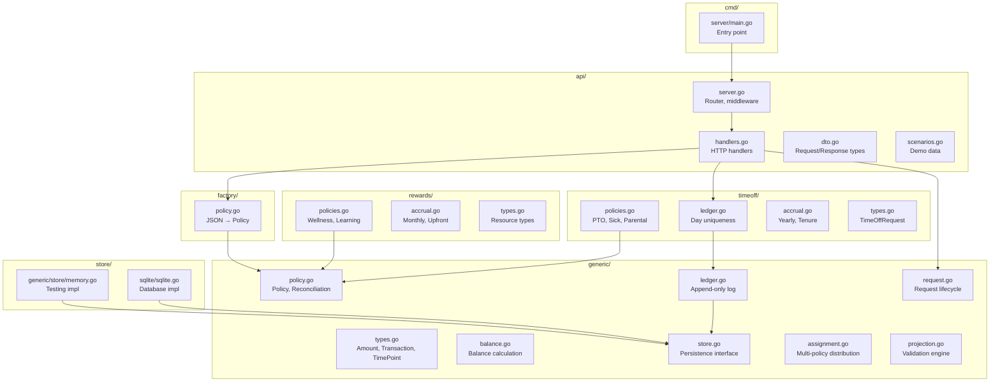
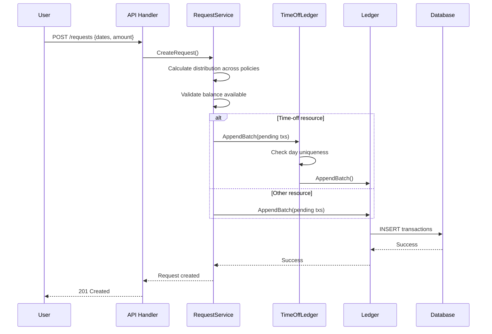
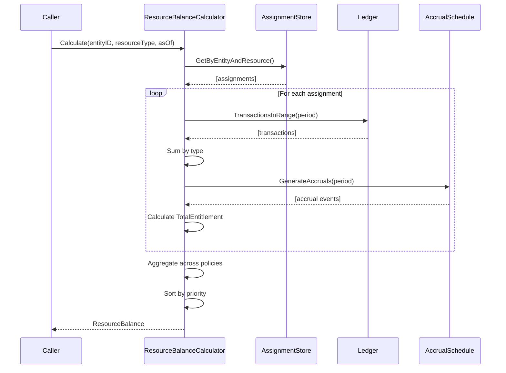
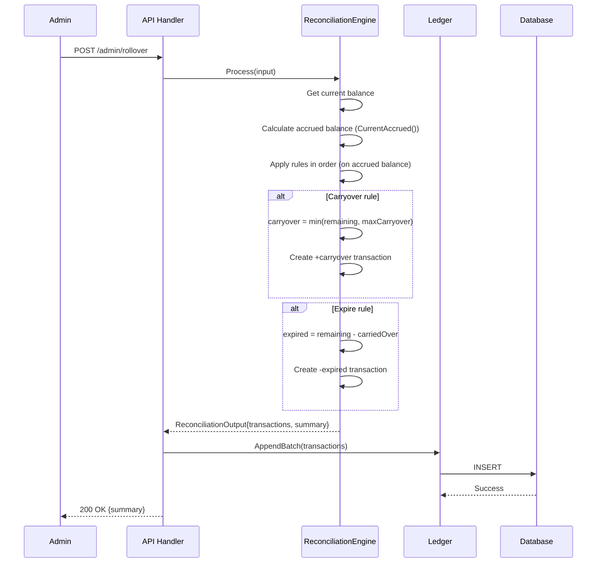
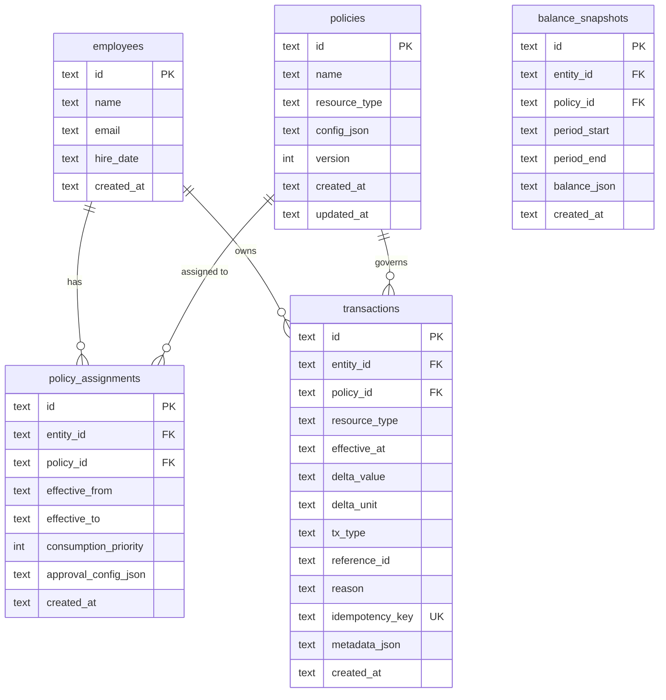
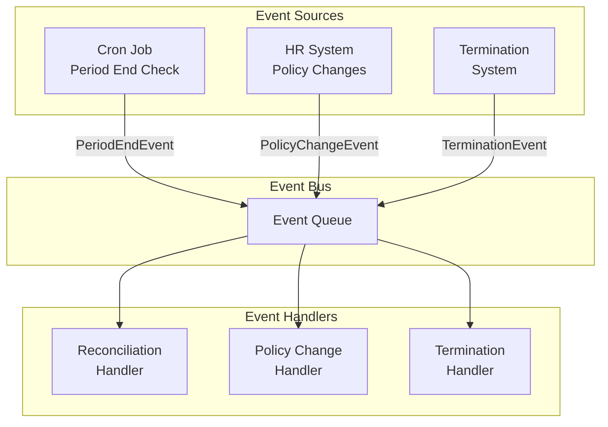

# Implementation Guide

> **Summary:** This document covers the technical implementation details of the Warp engine. The codebase is organized into `generic/` (core engine with interfaces and algorithms), `timeoff/` and `rewards/` (domain implementations that own their `ResourceType` definitions), `store/sqlite/` (persistence), `factory/` (JSON→Policy conversion), and `api/` (HTTP handlers). Key workflows include transaction writes (with idempotency and day-uniqueness checks), balance calculation (period-based, supporting ConsumeAhead and ConsumeUpToAccrued modes), and reconciliation (carryover, expiration, capping). The database schema includes transactions, policies, policy_assignments, and balance_snapshots tables with critical indexes for performance. Current status: core features complete (108 tests), auth/authorization not implemented (POC stage).

---

## Package Structure



---

## Core Components

### 1. ResourceType Interface

**Key Design Decision**: ResourceType is an interface, not a string.

```
ResourceType interface:
├── ResourceID() string      Returns "pto", "wellness_points", etc.
└── ResourceDomain() string  Returns "timeoff", "rewards", etc.
```

**Domain implementations:**
```
timeoff.Resource implements ResourceType:
├── ResourcePTO         = "pto"
├── ResourceSick        = "sick"
├── ResourceParental    = "parental"
├── ResourceVacation    = "vacation"
└── ... (registered in init())

rewards.Resource implements ResourceType:
├── ResourceWellnessPoints    = "wellness_points"
├── ResourceLearningCredits   = "learning_credits"
├── ResourceRecognitionPoints = "recognition_points"
└── ... (registered in init())
```

**Why an interface?**
- Generic engine has ZERO knowledge of domain-specific resources
- Domain packages own their type definitions
- Type safety at compile time
- Clean serialization via `ResourceID()`

### 2. Transaction (Ledger Entry)

The fundamental unit of the system. Every balance change is a transaction.

```
Transaction:
├── ID              Unique identifier
├── EntityID        Who (employee)
├── PolicyID        Which policy
├── ResourceType    ResourceType interface (not string!)
├── EffectiveAt     When it takes effect
├── Delta           Amount change (+accrual, -consumption)
├── Type            TxGrant | TxConsumption | TxPending | TxReversal | TxReconciliation
├── ReferenceID     Link to request/source
├── Reason          Human explanation
├── IdempotencyKey  Duplicate prevention
└── CreatedBy       Audit: who created this
```

**Transaction Types:**

| Type | Delta Sign | Purpose |
|------|------------|---------|
| `TxGrant` | + | Balance grant (bonus, carryover, hours-worked accrual) |
| `TxConsumption` | - | Approved usage |
| `TxPending` | - | Submitted but not approved (holds balance) |
| `TxReversal` | +/- | Undo another transaction |
| `TxReconciliation` | +/- | Period-end adjustments |
| `TxAdjustment` | +/- | Manual correction |

### 3. Policy

Rules governing a resource type.

```
Policy:
├── ID, Name
├── ResourceType           ResourceType interface (domain-owned)
├── Unit                   "days", "hours", "points", "dollars"
├── PeriodConfig           Calendar year, fiscal year, anniversary
├── ConsumptionMode        ConsumeAhead | ConsumeUpToAccrued
├── UniquePerTimePoint     true for time-off (no duplicate days)
├── Constraints            AllowNegative, MaxBalance, MaxRequestSize
└── ReconciliationRules    What happens at period end
```

### 4. Balance

Computed from transactions within a period.

```
Balance:
├── Period              Time boundary
├── AccruedToDate       What's been earned so far
├── TotalEntitlement    Full period allocation
├── TotalConsumed       Approved consumption
├── Pending             Awaiting approval
└── Adjustments         Manual corrections

Available() = 
  if ConsumeAhead:      TotalEntitlement - TotalConsumed - Pending + Adjustments
  if ConsumeUpToAccrued: AccruedToDate - TotalConsumed - Pending + Adjustments
```

### 5. TimeOffLedger (Domain Wrapper)

Enforces time-off specific invariant: **no duplicate days**.

```
TimeOffLedger wraps generic.Store with:
├── Append()       Check day not already consumed
├── AppendBatch()  Check no duplicates in batch OR existing
├── IsDayOff()     Query if specific day is taken
└── GetDaysOff()   List days off in range
```

**Uniqueness Constraint:**
- Key: `(EntityID, ResourceType, DATE(EffectiveAt))`
- Enforced at two levels:
  1. Application: `TimeOffLedger.validateDayUniqueness()`
  2. Database: `idx_unique_day_consumption` partial unique index

---

## Key Workflows

### Request Submission Flow



### Balance Calculation Flow



### Reconciliation (Rollover) Flow

**Critical Detail**: Reconciliation uses `CurrentAccrued()` (what was actually earned), not `Current()` (full entitlement). This ensures new hires and mid-year changes reconcile correctly.



**Why CurrentAccrued()?**
- New hires: Only reconcile what they earned (e.g., 2 days for December hire, not 24)
- Mid-year changes: Reconciliation reflects actual accruals, not full entitlement
- Correctness: Only earned balance can be carried over or expired

---

## Database Schema



### Critical Indexes

```sql
-- Hot path: balance calculation
CREATE INDEX idx_transactions_entity_policy_date
ON transactions(entity_id, policy_id, effective_at DESC);

-- Day uniqueness enforcement
CREATE UNIQUE INDEX idx_unique_day_consumption 
ON transactions(entity_id, resource_type, DATE(effective_at))
WHERE tx_type IN ('consumption', 'pending');

-- Entity-wide queries
CREATE INDEX idx_transactions_entity_resource_date 
ON transactions(entity_id, resource_type, effective_at);

-- Request tracking
CREATE INDEX idx_transactions_reference 
ON transactions(reference_id) WHERE reference_id IS NOT NULL;

-- Idempotency
CREATE INDEX idx_transactions_idempotency 
ON transactions(idempotency_key) WHERE idempotency_key IS NOT NULL;
```

---

## API Reference

### Employees

| Method | Endpoint | Description |
|--------|----------|-------------|
| `GET` | `/api/employees` | List all employees |
| `POST` | `/api/employees` | Create employee |
| `GET` | `/api/employees/:id` | Get employee by ID |
| `GET` | `/api/employees/:id/balance` | Get balance summary |
| `GET` | `/api/employees/:id/transactions` | Get transaction history |
| `POST` | `/api/employees/:id/requests` | Submit resource request |

### Policies

| Method | Endpoint | Description |
|--------|----------|-------------|
| `GET` | `/api/policies` | List all policies |
| `POST` | `/api/policies` | Create policy from JSON |
| `POST` | `/api/assignments` | Assign policy to employee |

### Admin

| Method | Endpoint | Description |
|--------|----------|-------------|
| `POST` | `/api/admin/rollover` | Trigger period reconciliation |
| `POST` | `/api/admin/adjustment` | Make manual balance adjustment |
| `POST` | `/api/reset` | Reset database (dev only) |

### Scenarios

| Method | Endpoint | Description |
|--------|----------|-------------|
| `GET` | `/api/scenarios` | List available demo scenarios |
| `POST` | `/api/scenarios/load` | Load a demo scenario |

---

## Configuration

### Policy JSON Schema

```json
{
  "id": "pto-standard",
  "name": "Standard PTO",
  "resource_type": "pto",
  "unit": "days",
  "period_type": "calendar_year",
  "consumption_mode": "consume_ahead",
  "is_unlimited": false,
  "unique_per_day": true,
  "accrual": {
    "type": "yearly",
    "annual_amount": 20,
    "frequency": "monthly"
  },
  "constraints": {
    "allow_negative": false,
    "max_balance": null,
    "max_request_size": 10
  },
  "reconciliation_rules": [
    {
      "trigger": "period_end",
      "actions": [
        {"type": "carryover", "max_carryover": 5},
        {"type": "expire"}
      ]
    }
  ]
}
```

### Environment Variables

| Variable | Required | Default | Description |
|----------|----------|---------|-------------|
| `PORT` | No | `8080` | Server port |
| `DATABASE_URL` | Yes | - | Database connection string |
| `LOG_LEVEL` | No | `info` | Logging level |
| `CORS_ORIGINS` | No | `*` | Allowed CORS origins |

---

## Current Implementation Status

### ✅ Complete

| Feature | Package | Notes |
|---------|---------|-------|
| Core ledger operations | `generic/ledger.go` | Append, batch, query |
| Transaction types | `generic/types.go` | All types implemented |
| Period-based balance | `generic/balance.go` | Both consumption modes |
| Policy definitions | `generic/policy.go` | Full constraint support |
| Reconciliation engine | `generic/policy.go` | Carryover, expire, cap |
| Multi-policy assignment | `generic/assignment.go` | Priority-based distribution |
| Request lifecycle | `generic/request.go` | Create, approve, reject, cancel |
| Projection/validation | `generic/projection.go` | Future balance validation |
| Day uniqueness | `timeoff/ledger.go` | DB + application enforcement |
| Time-off policies | `timeoff/policies.go` | PTO, Sick, Parental, etc. |
| Rewards policies | `rewards/policies.go` | Wellness, Learning, Recognition |
| SQLite persistence | `store/sqlite/sqlite.go` | Full implementation |
| JSON policy factory | `factory/policy.go` | JSON → Policy conversion |
| REST API | `api/handlers.go` | Full CRUD |
| React frontend | `web/` | Dashboard, scenarios |
| Database indexes | `store/sqlite/sqlite.go` | All critical indexes |

### ⚠️ Partial / Needs Work

| Feature | Status | What's Missing |
|---------|--------|----------------|
| Approval workflow | Backend only | No approval queue UI |
| Cross-period requests | Not started | Requests spanning year boundary |
| Balance snapshots | Schema only | No snapshot generation |
| Audit logging | Fields added | No audit query API |

### ❌ Not Implemented

| Feature | Priority | Notes |
|---------|----------|-------|
| Authentication | P0 | No auth on any endpoint |
| Authorization | P0 | No role-based access |
| Row-Level Security | P0 | No RLS policies |
| Event-driven reconciliation | P1 | Manual trigger only |
| PostgreSQL store | P1 | SQLite is dev only |
| Observability | P1 | No metrics/tracing |
| Manager approval UI | P2 | Backend exists |
| Team calendar | P2 | - |
| Blackout dates | P2 | - |
| Notifications | P2 | - |

---

## Event System (Proposed)

Currently, reconciliation is triggered manually. The proposed event system:



### Event Types

| Event | Trigger | Action |
|-------|---------|--------|
| `PeriodEndEvent` | Cron at midnight on period end | Run reconciliation for all entities with that period |
| `PolicyChangeEvent` | HR assigns new policy | Close old period, open new with prorated accrual |
| `TerminationEvent` | Employee leaves | Calculate final balance, create payout/forfeit |
| `HireEvent` | New employee | Assign default policies, prorate first period |
| `AnniversaryEvent` | Tenure milestone | Upgrade accrual tier |

---

## Testing

### Test Coverage

| Package | Test File | What's Tested |
|---------|-----------|---------------|
| `generic` | `engine_test.go` | Balance calculation, period handling, idempotency |
| `generic` | `assignment_test.go` | Multi-policy distribution |
| `timeoff` | `timeoff_test.go` | Multi-policy, rollover, consumption modes, policies |
| `timeoff` | `ledger_test.go` | Day uniqueness invariant |
| `rewards` | `rewards_test.go` | Wellness, learning, recognition |

### Running Tests

```bash
# All tests
make test

# Verbose
go test ./... -v

# Single package
go test ./timeoff/... -v

# Single test
go test ./timeoff/... -v -run TestMultiPolicy

# Race detector
go test ./... -race

# Coverage report
make test-cover
```

---

## Development

### Quick Start

```bash
# Install dependencies
make install

# Run with hot-reload
make dev

# Access
# Frontend: http://localhost:5173
# API:      http://localhost:8080/api
```

### Adding a New Policy Type

1. **Define in domain package** (`timeoff/` or `rewards/`):
```go
func NewPolicyType(id PolicyID) PolicyConfig {
    return PolicyConfig{
        Policy: generic.Policy{...},
        Accrual: &CustomAccrual{...},
    }
}
```

2. **Add accrual if needed**:
```go
type CustomAccrual struct {...}
func (a *CustomAccrual) GenerateAccruals(from, to TimePoint) []AccrualEvent {...}
```

3. **Add to factory** (if JSON support needed):
```go
func CustomPolicyJSON() string { return `{...}` }
```

4. **Write tests**

5. **Add to demo scenario** (optional)

### Adding a New Domain

1. Create new package: `mydomain/`

2. Define resource types in `types.go`:
```go
package mydomain

import "github.com/warp/resource-engine/generic"

// Resource implements generic.ResourceType
type Resource string

func (r Resource) ResourceID() string     { return string(r) }
func (r Resource) ResourceDomain() string { return "mydomain" }

const (
    ResourceFoo Resource = "foo"
    ResourceBar Resource = "bar"
)

// Register resources on package import
func init() {
    generic.RegisterResource(ResourceFoo)
    generic.RegisterResource(ResourceBar)
}
```

3. Create policies in `policies.go`

4. Create accruals in `accrual.go`

5. Add domain-specific wrapper if needed (like `TimeOffLedger`)

6. Write comprehensive tests using domain types:
```go
// ✅ Good: Uses domain type
ResourceType: mydomain.ResourceFoo

// ❌ Bad: Uses string
ResourceType: "foo"
```
