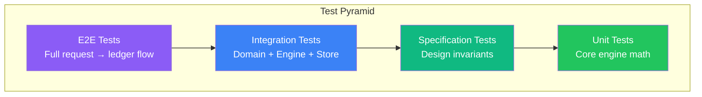

# Test Suite Documentation

> **Summary:** The test suite contains 135+ tests organized as executable specifications that validate and document system behavior. `generic/spec_test.go` contains 24 specification tests mapping directly to DESIGN.md requirements (ledger invariants, period-based balance, consumption modes, multi-policy distribution, reconciliation). `generic/engine_test.go` covers core math. `timeoff/` tests cover day-uniqueness enforcement, multi-policy consumption, rollover scenarios, and all time-off resource types. `rewards/` tests cover wellness points, learning credits, recognition points, and different units. `api/scenarios_test.go` contains unit tests for all demo scenarios. Every demo scenario (new-employee, multi-policy, year-end-rollover, hourly-worker, rewards-benefits) has corresponding unit tests. Tests use domain types (not strings) and follow GIVEN/WHEN/THEN format with explanatory assertions.

---

## Philosophy

> **Tests are executable specifications.**

Our tests serve three purposes:
1. **Specification** - Document the intended behavior from DESIGN.md
2. **Validation** - Ensure the implementation matches the specification
3. **Documentation** - Explain WHY the system behaves this way

Every test answers the question: *"What behavior does this specification require?"*

---

## Test Architecture



---

## Test Coverage by Package

| Package | File | Tests | Focus |
|---------|------|-------|-------|
| `generic/` | `spec_test.go` | 24 | Design invariants from DESIGN.md |
| `generic/` | `engine_test.go` | 35 | Core math, modes, reconciliation |
| `generic/` | `assignment_test.go` | 10 | Multi-policy distribution |
| `timeoff/` | `ledger_test.go` | 18 | Day uniqueness invariant |
| `timeoff/` | `timeoff_test.go` | 21 | Domain scenarios |
| `rewards/` | `rewards_test.go` | 13 | Points, credits, different units |
| **Total** | | **135+** | |

---

## Specification Tests (`generic/spec_test.go`)

These tests are **executable specifications** that validate the design from DESIGN.md.

### Test Format

Each spec test follows this structure:
```go
func TestSpec_Category_Behavior(t *testing.T) {
    // SPEC: Reference to DESIGN.md section
    // WHY: Explanation of why this matters
    
    // GIVEN: Setup
    // WHEN: Action
    // THEN: Assertions with explanatory messages
}
```

### Specification Test Index

| Test Name | Spec Area | Design Requirement |
|-----------|-----------|-------------------|
| `TestSpec_Ledger_AppendOnly_TransactionsCannotBeModified` | Ledger | No Update/Delete methods |
| `TestSpec_Ledger_Idempotency_DuplicateKeyRejected` | Ledger | Duplicate keys rejected |
| `TestSpec_Ledger_AtomicBatch_AllOrNothing` | Ledger | Batch is atomic |
| `TestSpec_Ledger_Ordering_TransactionsChronological` | Ledger | Transactions sorted by date |
| `TestSpec_Balance_IsPeriodBased_Not_PointInTime` | Balance | Period-based balance |
| `TestSpec_Balance_NonDeterministic_OnlyActual` | Balance | Non-deterministic = only actual |
| `TestSpec_ConsumeAhead_FullYearAvailableImmediately` | Modes | Full entitlement available |
| `TestSpec_ConsumeUpToAccrued_OnlyEarnedAvailable` | Modes | Only earned available |
| `TestSpec_ConsumeUpToAccrued_LaterInYear_MoreAvailable` | Modes | Available grows through year |
| `TestSpec_MultiPolicy_ConsumeByPriority` | Multi-Policy | Priority-based allocation |
| `TestSpec_MultiPolicy_SkipsExhaustedPolicies` | Multi-Policy | Skip zero-balance policies |
| `TestSpec_Reconciliation_Carryover_WithCap` | Reconciliation | Capped carryover |
| `TestSpec_Reconciliation_UseItOrLoseIt_AllExpires` | Reconciliation | All expires without carryover |
| `TestSpec_Reconciliation_NegativeBalance_NoAction` | Reconciliation | No action on negative |
| `TestSpec_Period_CalendarYear` | Period | Jan 1 - Dec 31 |
| `TestSpec_Period_FiscalYear_April` | Period | Custom fiscal year start |
| `TestSpec_Period_Anniversary` | Period | Hire date-based period |
| `TestSpec_Constraint_AllowNegative_True` | Constraints | Overdraft permitted |
| `TestSpec_Constraint_AllowNegative_False` | Constraints | Overdraft denied |
| `TestSpec_Reversal_RestoresBalance` | Corrections | Reversal undoes consumption |
| `TestSpec_Pending_DeductsFromAvailable` | Pending | Reserved from available |
| `TestSpec_AuditTrail_AllTransactionsPreserved` | Audit | Full history preserved |

---

## Time-Off Domain Tests

### Scenario Coverage (`timeoff/timeoff_test.go`)

| Test | Scenario | Features Tested |
|------|----------|-----------------|
| `TestMultiPolicy_ConsumesByPriority` | multi-policy | Priority distribution |
| `TestMultiPolicy_SkipsExhaustedPolicies` | multi-policy | Skip zero-balance |
| `TestMultiPolicy_ApprovalRequired` | multi-policy | Approval workflow |
| `TestRollover_FullYear_WithCarryover` | year-end-rollover | Carryover with cap |
| `TestRollover_MidYearHire_Prorated` | mid-year-hire | Prorated accruals |
| `TestRollover_NegativeBalance_CarriedForward` | - | Negative handling |
| `TestConsumeAhead_FullYearAvailableInJanuary` | new-employee | ConsumeAhead mode |
| `TestConsumeUpToAccrued_OnlyEarnedAvailable` | hourly-worker | ConsumeUpToAccrued mode |
| `TestYearlyAccrual_Monthly` | - | Monthly accrual |
| `TestYearlyAccrual_Upfront` | - | Upfront grant |
| `TestTenureAccrual_TierProgression` | - | Tenure-based tiers |
| `TestUnlimitedPolicy_NoBalanceTracking` | - | Unlimited PTO |
| `TestMultiResourceType_IndependentBalances` | new-parent | Multiple resource types |
| `TestMaternityLeave_FullUsage` | new-parent | Parental leave |
| `TestMaternityLeave_PartialUsage_Expires` | new-parent | Expiration |
| `TestFloatingHoliday_UseItOrLoseIt` | new-parent | Floating holidays |
| `TestBereavementLeave_Consumption` | new-parent | Bereavement |
| `TestEndToEnd_FullRequestFlow` | - | Full request flow |

### Day Uniqueness Tests (`timeoff/ledger_test.go`)

| Test | Invariant Tested |
|------|------------------|
| `TestTimeOffLedger_DuplicateDay_SinglePolicy_Rejected` | Can't take same day twice (same policy) |
| `TestTimeOffLedger_DuplicateDay_MultiplePolicy_Rejected` | Can't take same day twice (different policy) |
| `TestTimeOffLedger_DifferentDays_Allowed` | Different days OK |
| `TestTimeOffLedger_DifferentEmployees_SameDay_Allowed` | Different employees OK |
| `TestTimeOffLedger_BatchWithDuplicateDay_Rejected` | Batch validation |
| `TestTimeOffLedger_BatchValidDays_Accepted` | Valid batch OK |
| `TestTimeOffLedger_BatchConflictsWithExisting_Rejected` | Conflict with existing |
| `TestTimeOffLedger_IsDayConsumed_True` | Query consumed days |
| `TestTimeOffLedger_IsDayConsumed_False` | Query non-consumed days |
| `TestTimeOffLedger_DuplicateDayError_HasDetails` | Error includes details |

---

## Rewards Domain Tests (`rewards/rewards_test.go`)

| Test | Scenario | Features Tested |
|------|----------|-----------------|
| `TestWellnessPoints_MonthlyAccrual` | rewards-benefits | Monthly point accrual |
| `TestWellnessPoints_EarnThenSpend` | rewards-benefits | Earn and redeem |
| `TestWellnessPoints_Carryover` | rewards-benefits | Point carryover |
| `TestLearningCredits_FullBudgetAvailableImmediately` | rewards-benefits | ConsumeAhead for budget |
| `TestLearningCredits_UseItOrLoseIt` | rewards-benefits | Budget expiration |
| `TestLearningCredits_TrackExpenses` | rewards-benefits | Expense tracking |
| `TestRecognitionPoints_KudosReceived` | rewards-benefits | Peer recognition |
| `TestRecognitionPoints_Redemption` | rewards-benefits | Point redemption |
| `TestFlexBenefits_WithCarryover` | rewards-benefits | Flex spending |
| `TestRemoteWorkDays_MonthlyAllowance` | rewards-benefits | Monthly allowance |
| `TestVolunteerHours_UpfrontGrant` | rewards-benefits | Upfront grant |
| `TestVolunteerHours_Usage` | rewards-benefits | Hour usage |
| `TestMultipleRewardTypes_IndependentBalances` | rewards-benefits | Multiple types |

---

## Scenario-to-Test Mapping

### Scenario: new-employee
```
Employee: Just hired with single PTO policy
Tests:
  ✓ TestConsumeAhead_FullYearAvailableInJanuary
  ✓ TestYearlyAccrual_Monthly
  ✓ TestScenario_NewEmployee (api/scenarios_test.go)
```

### Scenario: mid-year-hire
```
Employee: Hired in June with prorated accruals
Tests:
  ✓ TestRollover_MidYearHire_Prorated
Note: This scenario was removed - use new-employee or multi-policy instead
```

### Scenario: year-end-rollover
```
Employee: At year end with balance to roll over
Tests:
  ✓ TestRollover_FullYear_WithCarryover
  ✓ TestSpec_Reconciliation_Carryover_WithCap
  ✓ TestSpec_Reconciliation_UseItOrLoseIt_AllExpires
  ✓ TestScenario_YearEndRollover (api/scenarios_test.go)
Note: Reconciliation uses CurrentAccrued() to reconcile only earned balance
```

### Scenario: multi-policy
```
Employee: 3 PTO policies + sick leave
Tests:
  ✓ TestMultiPolicy_ConsumesByPriority
  ✓ TestMultiPolicy_SkipsExhaustedPolicies
  ✓ TestMultiPolicy_ApprovalRequired
  ✓ TestSpec_MultiPolicy_ConsumeByPriority
```

### Scenario: new-parent
```
Employee: Maternity + PTO + Sick + Floating holidays
Tests:
  ✓ TestMultiResourceType_IndependentBalances
  ✓ TestMaternityLeave_FullUsage
  ✓ TestMaternityLeave_PartialUsage_Expires
  ✓ TestFloatingHoliday_UseItOrLoseIt
  ✓ TestBereavementLeave_Consumption
```

### Scenario: rewards-benefits
```
Employee: Points system with multiple reward types
Tests:
  ✓ TestWellnessPoints_MonthlyAccrual
  ✓ TestWellnessPoints_EarnThenSpend
  ✓ TestWellnessPoints_Carryover
  ✓ TestLearningCredits_FullBudgetAvailableImmediately
  ✓ TestLearningCredits_UseItOrLoseIt
  ✓ TestRecognitionPoints_KudosReceived
  ✓ TestRecognitionPoints_Redemption
  ✓ TestFlexBenefits_WithCarryover
  ✓ TestRemoteWorkDays_MonthlyAllowance
  ✓ TestVolunteerHours_UpfrontGrant
  ✓ TestMultipleRewardTypes_IndependentBalances
```

### Scenario: hourly-worker
```
Employee: Hourly with consume-up-to-accrued policy
Tests:
  ✓ TestConsumeUpToAccrued_OnlyEarnedAvailable
  ✓ TestSpec_ConsumeUpToAccrued_OnlyEarnedAvailable
  ✓ TestSpec_ConsumeUpToAccrued_LaterInYear_MoreAvailable
```

---

## Running Tests

```bash
# Run all tests
go test ./...

# Run with verbose output
go test ./... -v

# Run specific package
go test ./generic/... -v

# Run specific test
go test ./generic/... -v -run "TestSpec_Ledger"

# Run with coverage
go test ./... -cover

# Generate coverage report
go test ./... -coverprofile=coverage.out
go tool cover -html=coverage.out
```

---

## Test Design Principles

### 1. Tests Document Behavior
Every test name should read like a specification:
- ✅ `TestMultiPolicy_ConsumesByPriority`
- ✅ `TestSpec_Ledger_AppendOnly_TransactionsCannotBeModified`
- ❌ `TestLedger1` (meaningless)

### 2. GIVEN/WHEN/THEN Comments
```go
// GIVEN: Employee with 20 days PTO, 5 days carryover
// WHEN: Requesting 10 days in January
// THEN: Takes 5 from carryover, 5 from current year
```

### 3. Assertions Explain Failures
```go
if !result.IsSatisfiable {
    t.Error("SPEC VIOLATION: Multi-policy should satisfy request from combined balance")
}
```

### 4. No Test Interdependence
Each test creates its own state. No shared mutable state between tests.

### 5. Domain Tests Use Domain Types
```go
// ✅ Good: Uses domain type
ResourceType: timeoff.ResourcePTO

// ❌ Bad: Uses string
ResourceType: "pto"
```

---

## See Also

- `DESIGN.md` - Design philosophy and concepts
- `generic/spec_test.go` - Executable specifications
- `api/scenarios.go` - Demo scenario definitions
